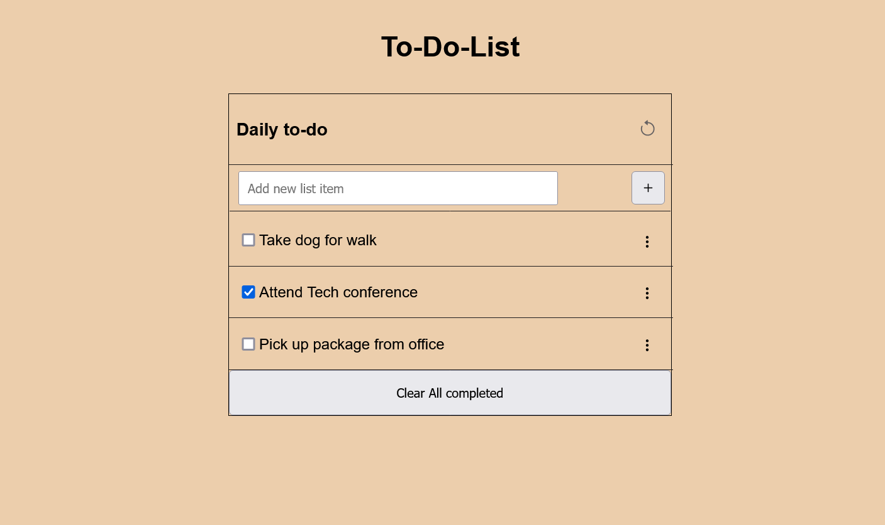

## To-Do-List App

> In this project, I made a simple website called To-do-List which uses CRUD methods. The user is able to add, remove, edit tasks & mark them as done or undone. The added tasks are arranged in a list at the top of the page. I built this app using webpack.

.

## Built With

- HTML & CSS
- Github
- Javascript
- Webpack

## Live Demo 

[liveDemoLink](https://TracyMuso.github.io/To-Do-List/)

## Getting Started

**To get a local copy up and running follow these simple example steps.**

# Prerequisites

- Github flow knowledge. -Intermediate CSS, HTML and Javascript. -Installation of linter files. -install webpack

# Setup 
- To clone the repository run [https://github.com/TracyMuso/To-Do-List] in your terminal

# Usage
- This can be used as a simple to-do list app to add and remove your daily tasks.
- **NOTE**: The mobile version is currently unavailable.

# Install
- Set up Github Actions
- Set up linter > Lighthouse , Webhint ,Stylelint , Eslint.
- Webpack bundle for javascript.

## Author

👤 **Tracy Musongole**

- GitHub: [@githubhandle](https://github.com/TracyMuso)
- Twitter: [@twitterhandle](https://twitter.com/tracy_muso)
- LinkedIn: [LinkedIn](https://linkedin.com/in/tracy-muso)

## 🤝 Contributing

Contributions, issues, and feature requests are welcome!

Feel free to check the [issues page](github.com/TracyMuso/To-Do-List/issues/).

## Show your support

Give a ⭐️ if you like this project!

## Acknowledgments

- Hat tip to anyone whose code was used
- Inspiration
- etc

## 📝 License

This project is [MIT](./LICENSE) licensed.
